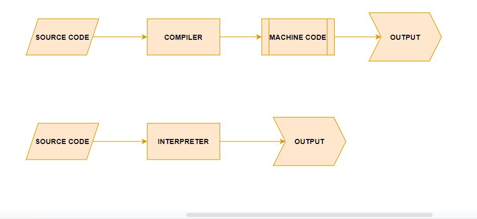
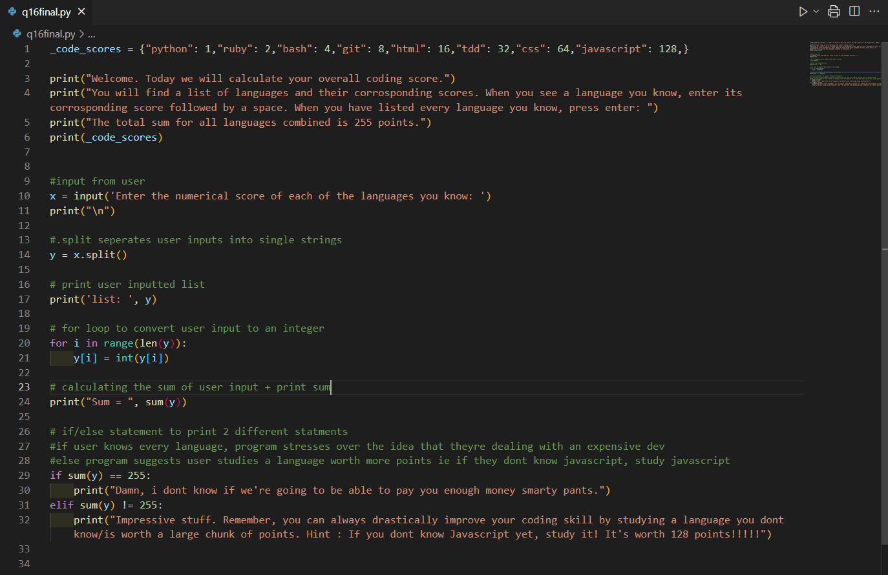

# Term 1 A1 Assignment: Christopher Lee 12189@CoderAcademy.edu.au

### **Assignment Brief: Demonstrate knowledge of fundamental programming concepts and the web. Provide a series of short answers to the specified questions.**

# **Question 1: Identify and explain common and important components and concepts of web development markup languages.**

Three popular markup languags that you are likely to encounter in your career in computer science are: HTML, XML and XHTML. These versions share similarites and differences; as the internet evolves and grows, so do markup languages. However, with an evolving web environment, continuity and compatability issues can arise. This issue was predicted and as such, versions of HTML represent standardized improvements to the foundational language for the World Wide Web. This standardization however, does not mean that these markup languages do not have their differences. For example, when comparing the functionality of HTML and XML, it would be important to note that although they do similar things, how they do it is rather different. XML focuses on transporting data without any management towards the presentation of the document -for lack of a better word. This means, XML is very easy to work with. HTML however, focuses on the presentation of the document and as a consequence, its coding can become rather complex. 
Due to the aftermentioned standardization practices, both XML and HTML can work together.

Markup languages sharing compatability is great and all, but why do we even need markup languages in the first place?

In order for a browser to be able to interpret and reproduce information in the way we want, we need to provide a uniform structure to the web pages we create. Structuring our web page to explain where to place certain content, how certain content should look and even conditions upon how we want content to behave allows use to produce reliable, intentional and reproducable outcomes. This is where markup languages come into play, markup languages have the power needed for us to control very important components of web pages. Important components of web pages are things such as tables, forms, lists, headings and style. Using markup languages such as HTML, we can format our document and provide that information to the browser so that it replicates it on the web!

# **Question 2: Define the features of the following technologies that are essential in terms of the development of the internet**:
 - _packets_
 - _IP addresses (IPv4 and IPv6)_
 - _routers and routing_
 - _domains and DNS_  
# **Explain how each technology has contributed to the development of the internet.** 

**Packets**: Sending information across the internet is a mysterious capability that seemingly functions magically.However, the process of delivering data from one computer to another is actually a very logical process. To understand why data is broken down into packets, we first need to understand _how_ computers communicate. Computers communicate to one another using **binary**. Computers use transistors to act like electronic swithces, being that they are either _on_ or _off_. The simplest way to convey the desired command to another computer is through binary, being that the number 0 will represent **on** and the number 1 will represent **off**.   
  Now imagine you want to send a reasonably large sized file across the internet. In order to do that, both computers -or however many computers are on the recieving network- will _talk_ to one another via binary and corresponding electrical signals. Sending the file in one complete "package" will not be the most efficent way for your data to travel. Because the data is sent via a physical connection of wires, the possibility of congestion increases exponentially the moment more than 2 computers are involved.  
This is where packets come in.  
  Data is broken into packets in order to decrease latency and increase overall efficiency of the journey from one computer to another. These packets are sent as incredibly small, deconstructed "packages" which can then be reconstructed on the recieving end.  
Packets are seperated into incredibly small pieces of data - **_64kb_**- each of these pieces of data carries information that i being sent from one computer to another. For example; some of these packets will contain information regarding the sender, such as their ip address, others will contain information that explains how many packets the reciever should expect to see. Other packets serve purposes such as informing the recieving computer when it has reached the end of the packet sequence.   
 Because of the way this data is structure during sending, we are able to communicate with large networks and send information across the globe seemingly instantly. In terms of the development of the internet, i strongly believe that packets have contributed massively. Without packets, trasnfer efficiency of data  would be congested and slow, it would be a nightmare in todays world and would seriously hinder the progression and development of tech.  
 

 

**IP Addressess**: In order for us to transfer data across the internet, we need to know _where_ to actually send said data. Comparable to your physical street address, an IP address is used as a means to identify hardware on networks. To simplify, if you wanted to send a letter to a friend, you would need to know what their address is. Their physical address identifies their house on a street with multiple other houses. The same principle applies to computers. Having IP addresses, allows both devices to connect and trasnfer data over the internet. IP addresses are unique  and consist of a string of numbers seperated by periods. For ipv4, the older IP framework, the string of numbers are seperated into 4 sections. Each section ranges between 0 and 255. This means that an ipv4 IP address would look something like this: **127.0.0.1**.
One of the shortcomings of ipv4 is the sheer amount of hardware that exsits in the world today. Computers, routers, websites etc all have unique IP addresses. Consequently, this means we will reach the maximum amount of unqiue identifiers under this framework. So how do we get around this shortcoming? 
  Introducing ipv6. In order for ipv6 to adapt to the increasing amount of techonological presence in the modern world, it implemetedan alphanumerical hexadecimal notation. Meaning, IP addresses now contain both letters **and** numbers. Ipv6 uses 128-bit addresses formatted into 8 groups of 4 hexadecimal numbers.  
An example of an ipv6 IP address is: **2002:0de6:0001:0042:0100:8c2e:0370:7234**   
One of the benefits of such a complex string of numbers and letters is that even in 2022, each device can have its own IP address, as opposed to needing to reuse addresses or mask them.  
  In todays tech world, both ipv4 and ipv6 are in use. As tech continues to develop and old technology is retired, the use of ipv4 will slowly begin to decline until it is replaced entirely by ipv6.  
In terms of the development of the internet, ipv6 was an incredibly intelligent piece of technology implemented as a means to fix an originally unforseen problem. Its mere existence is nothing short of completely neccessary in todays world and its implementation is, in my opinion, an incredibly impressive feat of intelligence, perserverance and quick-thinking-problem-solving completed by engineers.  
 

 

**Routers and Routing:**
Routers are used to connect devices such as computers or phones to the internet. Typically, a wireless router will connect directly with a modem. From there, information can be recieved or transmitted to the internet. Routers use built in attenas to communicate with devices on the home network. A wired router however, would connect directly from the modem to the device (computer).
Earlier, i wrote about packets. Thats how information is broken down for "shipment". I then spoke about IP addresses, thats how the "shipment" knows where to go and where it came from. All of that is great but without routers, it doesnt mean much. See, the purpose of a router is to provide the framework for the other two actions to take place. Meaning, without network connectivity, the rest is meaningless. Routing is the ability to send or forward packets from my network to someone elses network (or vice versa).The role of the router is to connect the 2 (or more) networks and then manage the traffic within. Using something called a routing table (list of all possible paths on the network) routers are able to recieve packets, crosscheck the routing table and then figure out the fastest path to send that data along.
Because of its capability to route traffic between devices and the internet, your home devices are able to connect to the internet.
In terms of the development of the internet, routers have played a vital role as they are responsible for security, connectivity, packet filtering etc. These tasks are incredibly fascinating and seem to occur seemlessly thanks to the technology involved.  
   

   

**Domains and DNS**: Earlier, i wrote about IP addresses and their contribution to the function of the internet. One of the topics covered was Ipv6 and its Alphanumeric Hexadecimal notations. What a mouthful that is. When browsing the web, if we attempted to navigate our way around using IP addresses such as the ones Ipv6 provides, i suspect 90% of the population would struggle to memorize the address of even a single website. That could generate a problem. For us to browse the web more intuitively, we use something called **Domain Names**. Domain names are easily recognisable and you already have multiple memorised. For example, you already know the domain "_gmail_" and you already know the domain "_google_". Naturally, it is much easier to remember words, especially short words, and so, the **Domain Name System** (DNS) can act like a phonebook in the sense that, the complicated numbers are not what you need to know- only the names!  

When you enter a domain name into a browser, DNS will translate that domain name into its IP address and youll find yourself arriving at your desired website.
To write out the entire translation process of DNS to IP would result in quite a lenghty paragraph of complex terminology, so instead, i will simplify what is going on when we enter a domain name and it somehow spits out the correct IP address.  
There are 4 DNS Servers involved with the process of loading a webpage. These servers are : **DNS Recursor, Root Nameserver, TLD Nameserver and Authoritative Nameserver.**  

DNS Recursor: The recursor server handles queries from the clients machine, its role is to begin locating where the correlated IP address is and to also make any additional queries necessary in order to move forward with information that is both sufficient and as accurate as possible. The website "Cloudflare" likens the role of the Recursor server to that of a librarian, in the sense that a librarian will be asked where a particular book is located within a library.  

Root Nameserver: This server is the where the intitial translating steps happen.These servers are capable of directly answering queries made about cache and stored records. Typically, the role of the root nameserver is to narrow down more specific locations that are needed to correctly translate the domain name into an IP.  It is worth noting, the name Root Nameserver is allocated due to where the server itself operates. This server operates in the "Root" of the DNS administration hierarchy.

TLD Nameserver: TLD is an acronym that stands for Top Level Domain, using the library reference again (provided by the "Cloudflare" website), the TLD nameserver can be imagined as a specific rack of books stored in a library. By understanding the acronym, we can begin to notice the steps involved with narrowing down information relevant to the client query. This particular nameserver helps narrow down what were searching for due to it hosting the end of domain names. To clarfiy, if a website is called "www.google.com", the TLD server hosts the ".com" section of the domain name.  

Authoritative Nameserver: This server is the final step in the resolving process,think of this server as a large ledger or a large phone book. If this server has access to the requested information/records, it will be able to provide the translation needed from Domain to IP. Assuming everything runs smoothly and records are accessible, this nameserver will then provide the requested IP for the relevant domain to the DNS recursor that orginally requested it.  

So, what a journey that is, and to think this process happens in mere seconds with todays technology. In order to further understand, compare definitions against the picture below.  
  
   To concude this section and to define the contribution DNS makes and has made to the interent, the simplest way to do this is via a question.  
How many Ipv6 addresses do you think you can remember? And if you couldnt remember any, how would you keep a record of sites you wanted to visit?
  

   

# **Question 3: Define the features of the following technologies that are essential in terms of the development of the internet:**
 - TCP
 - HTTP and HTTPS
 - Web browsers (requests, rendering and developer tools)

# **Explain how each technology has contributed to the development of client and server communication over the internet (50 - 150 words for each technology**
**TCP:** TCP is an acronym that stands for Transmission Control Protocol. TCP enables the exchange of messages between computing devices and applications over a network.  Its functionality is designed around sending packets across the internet and further ensuring that the delivery of the data is successful. This particular protocol is one of the most popular protocols and it defines the standard for end-to-end data delivery methods. TCP organizes data in a manner that can be transmitted between the client and the server, additionally, the integrity of said data is ensured; in short, this is due to a connection that is established between the client and the server. Said server remains active during the entirity of the transfer. This is a massive leap forward for the devlopment of the internet as it means we have a way to implement a guarentee that our data can be sent from one location to another in a manner secure/stable enough that we know it will arrive in full. 

 
  
**HTTP and HTTPS:**  
HTTP: Hyper-text-transfer-protocol is most commonly used for the transfer of data between web servers and web browsers. This transfer of data allows us to view webpages. HTTP is one of the earliest protocols related to the internet. One of the disadvantages of HTTP is that there is no encryption on data passed between servers and browsers. Regardless, a typical data exchange between server and browser would involve the client machine requesting data and the server responding tothe request.  

HTTPS: Hyper-text-transfer-protocol-secure is the encrypted version of the aftermentioned HTTP. The purpose of encryption in regards to this protocol is to allow for the exchange of sensitive information or data with a server. Previously, with HTTP there was no encryption, consequently, this meant distributing sensitive information such as bank details was incredibly dangerous.
HTTPS use SSL (Secure-socket-layer) keys to ensure confidentiality and security of its connections. HTTPS prefixes can be found easily on most sites that require senstive data exchange such as your local banks website.   

 

**Web Browsers: (requests/rendering/developer tools):**  
Requests: When you place a request via a browser, a number of operations take place. Previous questions explain in further detail exactly how those operations are undertaken so i will use this oppurtunity to shed light on the order they occur and how they co operate. So, you enter a website into your web browser. Firstly, the browser will go to DNS servers to find where exaclty the address youre looking for is located. Secondly, the browser will then send a HTTP request to the server. This step is made possible via the TCP technology previously covered. Thirdly, when/if the request is approved by the server, packets will begin exchanging between the server and the client.Forth and final, the recieved packets reassemble at the client end and your browser will display the webpage. This order or operations happens incredibly fast and is responsible for the way we enjoy the internet in modern times. The development of this technology has seen increased efficiency in recieving, actioning and responding to requests.

**Rendering:** Put simply, the rendering of a website via a web browser is the process in which code, such as HTML or CSS is transformed into an interactive environment for a user to explore.While the webpage is loading, the server is sending files containing some type of formatting language, typically HTML. The browser engine takes these files and converts them from data into characters (HTML characters/code). HTML code is a readable formatting language that your web browser can use as a set of instructions. These instructions dictate where and how content is formatted and how it behaves. Because computers communicate directly using binary -which is not legible to the majority of people- the importance of rendering increases immensely. Websites need to be presented in a way that is legible, user friendly and intuitive. Renderding software/technology plays a vital role in coverting unfamiliar data into familiar means of content.  

**Developer tools:** Developer tools are an incredibly useful addition to browsers. These tools allow the user to inspect a range of formatting information that was used in the construction of the web page. These tools allow minor editing capabilites, though it is worth noting, changes made in the developer tools apply in your-eyes-only type of application; meaning, developer tools will allow you to do something like change the colour of the font on the page but these changes are for display/learning reasons and do not actually implement any new formatting onto the webpage. Browsing through the webpage with developer tools open allows you to see what CSS styling was used, where it was applied and how it affects the targeted content. This employs major benefits for learning developers that see something they like and want to reciprocate. Developer tools will display HTML, CSS and Javascript as well as what assessts were requested by the webpage and how long they took to load! Developer tools are an incredibly useful addition to your browser and the accessibility and education they provide to learning or learned developers is incredibly valuable.  

 

# **Question 4: Identify 3 data structures used in the python programming language and explain the reason for using each.**  
Data structures are fundamental constructes used when building programs in python.
Each structure organises data in a particular way so that it can be accessed conveniently and easily.  3 native data structures are Dictionaries, Arrays and Sets/Multisets.  

**Dictionaires:**  
Dictionaries store an arbitrary number of things. Each of the stored objects can be accessed via a unique dictionary key.  
Objects are defined as dictionary items by using the curly-braces ({}). You can assign keys a value by using the colon (:). ie  
dictionary{  
   < key>: < value>  
   < key>: < value>  
}  

In the dictionary created above, there are 2 keys. Both are assigned a value. This allows for efficient access to the dictionary.
Dictionaires are incredibly dynamic and they grow at your own discresion.  
  
**Tuple:**  
Tuples are basic python data structures used for ordered collections of objects. They are somewhat limited in comparison to other data structures like lists. Tuples are immutable, meaning that after the object is created and had its value assigned, it can **not** have its value modified.  
When using Tuples, parentheses are not compulsory, though it is reccomended. So, why use a Tuple considering it is immutable? Why not use a list or something like that? Well, the intended use case for Tuples is scenarios where you intend to keep an object/value intact throughout the life of your program. Put better, Tuples protect against accidental modification/removal of data. So now, in a scenario where you know you have a value you wish to apply and you know it is not intended to be changed, you incoporate the use of Tuples. Another fascinating feature of Tuples is that due to their immutability, python sees them as a single entity! The benefits of this arrise around the speed of new exectuions, however, the explination as to why seemed to get pretty tech heavy so ill keep it simple and leave it at that.  
  
**Sets/Multisets:**  
Sets are used in a similar way to tuples, they store values in a variable. The fascinating part about sets however is that they store multiple items in a single variable.  Think of it like assigning a list to a variable.  
Set items are unordered, unchangeable and do not allow duplicate values. There are pros and cons to this. Sets can be created by listing all of the elements we want included in the set inside of curly brackets ({}). Sets are brilliant for scenarios where you may need to store different data types such as integers or floats.  

# **Question 5: Describe the features of interpreters and compilers and how they are different.**  
Interpreters work by translating one line code/statement at a time into machine code. This means an interpreter can analyse source code quite quickly. A great feature of an interpreter is that it will continue translating source code until it encounters an error. This is incredibly useful for debugging as it allows us to see where the problems in our code are! Python is a language that uses an interpreter. For example, if i write some code in python and i make an error on line 5, python will translate the code into machine code until line 5. Once there, it will stop translating and alert us that line 5 contains an error!  

A compiler on the other hand will scan the entrire document and translate it into machine code in one go. This method is slower than the interpreter's way in term of analysing the source code but it does end up being quicker in general  when considering overall processing time. Compilers are a little bit trickier to try and debug with because they only generate error messages after the entire source code document is scanned.  
  

# **Question 6: Indentify 2 commonly used programming languages and explain the benefits and drawbacks of each.**  
2 of the most commonly used programming languages today are Python and Javascript. Both programming languages have benefits and drawbacks in their own way.  

**Python:**  
Beginning with python; Python is a beginner friendly language, due to its simplicity, it attracts beginners from around the world. Once beginners get involved with python, they are greeted by an incredibly large and friendly community that is more than happy to help answer any and all questions. Python is a flexible language that can extend to other programming languages such as C and C++.  Python is also considered highly scalable, meaning it can absolutely handle larger and more intricate apps/programs/projects. Some of the cons of Python involve its insecurity. Python is not 100% secure, to ensure your codes security, you would need to take extra and necessary steps. Another drawback that python users face is speed, particulary when compared to compiled languages. Python, being an interperted language is (overall) slower than compiled languages.

**Javascript:**
Javascript is another impressive programming language that is incredibly popular and sought after today. Like python, it boasts many pros but also has its own set of cons. 
Javascript is known in part for its incredible versatlity. It is functional for both front and back end development. Through the use of libraries, it is able to work both ends in a rather impressive mannner. 
Javascript is also incredibly popular because of how well it co-exsists/works with other languages. This type of cooperation is a massive pro in favour of javascript. But it is not without flaw. Some noteable cons regarding Javascript are things such as browser support. Different browsers interpret Javascript in different ways, you can already understand how this becomes an issue. It can also be quite difficult to debug using javascript due to browsers not displaying error messages. As a conseqeunce, developers may need to seriously hunt to find whatever issue they are experiencing. Another incredible downside to consider is the fact that a single error code can interrupt the rendering of Javascript. Typically broswers are quite tolerant of these errors but its still worth noting.

# **Question 7: Identify TWO ethical issues from the areas below and discuss the extent to which an IT professional is ethically responsible in terms of the issue.**

List of topics containing ethical issues:
 - access to a user’s personal information (medical, family, financial, personal attributes such as sexuality, religion, or beliefs)
 - intellectual property, copyright, and acknowledgement.
 - criminal acts such as theft, fraud, trafficking and distribution of prohibited substances, terrorism
 - GPS tracking data and other types of metadata, MAC addresses, hardware fingerprints
 - freedom of thought, conscience, speech and the media
 - aggressive sales and marketing practices designed to mislead and deceive consumers
 - trading of shares on the stock exchange OR crypto-currencies

For each ethical issue identify a source of legal information relating to the ethical issue and discuss whether the law is helpful in assisting a developer to act in an ethical way. (Word count guide: 200 words max)

Conduct research into a case study of ONE of the ethical issues you have chosen discuss how an ethical IT professional should respond to the case study and how they might mitigate or prevent ethical breaches. (Word count guide: 400 - 600 words)

**Identify 2 topics containing ethical issues and discuss ethical responsibility for IT professionals:** 

**Ethical Issue 1: Access to users personal information ethical issue:** In the modern world, there is a plethora of personal and sensitive information stored on the internet. The intended use for such sensitive personal information may be something along the lines of; communicating with doctors, communicating with banks, communicating with friends and family, storing information on a regularly used shopping website for a faster experience etc. All of this information made available to people and companies is done so with the intention that the use case of that data is relevant to what it was provided for.
Ethical issues around personal data, in my opinion, arise around that data being sold from company to company for the development of more personalised ads. For example, i personally provided my data to Facebook with the intention of being able to use it to commmunicate with family. I did not however, provide that data on the basis that it could be used as tool that can be sold and shared between other companies so that they can tailor ads and algothrims to encourage maximum spending/screen time on my end. Legally however, i agreed to the terms and conditions of using Facebook. This means that Facebook will collect and store my data. From there, Facebook uses my data as leverage in generating sales; meaning that advertising companies can reach out to Facebook and have them target users/myself with their ads. I believe this is an ethical issue because my data is knowingly being used against its intended purpose, without consent, to generate revenue.

So where does ethical responsibility of IT professionals fit into this issue with facebook?

Ethical responsibility for an IT professional is a little different. IT professionals are simply means to an end or a goal that is already set in progress, for example, Facebook's buisness model would not change based on which IT professional they engaged to complete the works. 
And so, we must consider ethical responsibility from the perspective of the individual, not the corporation. Ethical responsibility for an individual would represent itself as something like competence or honesty or working safely for yourself and for others - so as to not cause harm to others or yourself. Ethical responsibility would also include rejection of bribray/external influence for the benefit of ones self. This is incredibly important if you were to imagine the implications that bribery could have in the IT world. Bribery would constitute for a massive safety concern. Imagine if a domestic violence victim was to move house, away from their abuser. Say the abuser was to then go to an IT professional and bribe them to provide sensitive information they may have access to. Examples like these seem extreme, but they really do a good job at emphasising just how sensitive personal information/data can be.

**Ethical issue 2: Intellectual property, copyright, and acknowledgement:**

Ease of access to information is afforded to everyone with an internet connection. This is an absoultely insane privilege to have. Because of this, we are able to undertake education in ways not previously even imaginable, share information and locate knowlege that otherwise wouldve taken an enourmous effort to find. Because of this ease of access, the redistribution of any information/creation is incredibly common. This is where intellectual property and copyrights enter the mix. People deserve credit for their discovers, they deserve ackowledgement for their efforts and they also deserve the monetery value that their works may reap. After all, why would anyone innovate anything if everyone was allowed to copy/steal it and use it for their own benefit without acknowledging the efforts involved to the creator?
This very idea is where a lot of potential ethical issues can arise. Plagerising work in the academic world is just about the largest sin a student could commit. And so, there is a  large degree of ethical responsibility on students. Learning materials can be studied, paraphrased, referenced, quoted etc. All of these examples will actually further a students understanding of the source material. For IT students and professionals, ethical responsibility follows the same basic ideas as mentioned, but the line becomes a bit muddied when put into practice. To elaborate, there is a finate amount of ways for someone to write code that will produce a specific outcome. Consequently, work completed by professionals and by students is bound to eventually bear many similarites or even become the same. So what are the ethical responsibilities for IT personnel? I feel that personnel in the IT community will still be able to perform majortity of their works while following regular ethical practices; ie referencing, quoting, paraphrasing. In situations where they may need to use code that they did not write, depending on the source of that information, they may not even have any extra responsibilities towards ethical use of the information. For example, Stack Overflow is a website commonly used by developers, on the forum, people often ask questions or advice to which other users respond with a functional piece of code etc. This information was provided with the intent and implied permisson that it could be used in another environment outside of the forum, for another purpose. That information has no intention of gaining intellectual property status/copyright. And so, that infomration is ethically sourced, ethically used and will not require a reference or fear of repurcussion.
To summarise, Intellectual property is important in ensuring the integrity, quality, accuracy and originality of information or inventions. Copyright laws are put in place to protect intellectual properties of an individual or company.
This ensures that people are correctly acknowledged for their work/efforts and their discoveries. It ensures they rightfully receive monetery compensation for their work (where applicable) and it proctects and encourages innovation.

**For each ethical issue identify a source of legal information relating to the ethical issue and discuss whether the law is helpful in assisting a developer to act in an ethical way: (Word count guide: 200 words max)**

**Ethical Issue 1 - _Continuation of Access to users personal information ethical issue_ - identify a source of legal information relating to the ethical issue and discuss whether the law is helpful in assisting a developer to act in an ethical way:**  
Australian privacy law allows organisations and angencies to use and disclose your personal informationfor the reason they collected it. Unless you provide explicit consent, they cannot use your information for another reason/secondary purpose. There are a couple of exceptions to the law. The exceptions surround consent, whether they believe it is reasonably necessary to provide the information to authorites and that if the secondary purpose is for use of the information in the courts, tribunal orders. With strict laws surrounding the use of collected personal information, i believe it does indeed provide a clear framework for develops to abide by. Having this framework to understand and abide means that developers have a tangible, consistent manner that they can incoporate into their work. Without such a framework, it may become confusing for a developer in terms of how they can and should operate and conduct themselves. To summarise, yes, 
Australian privacy laws help assist devlopers to act and conduct themselves in an ethical way by providing the framework for how to act in an ethical way.

**Ethical Issue 2 - _Continuation of Intellectual property, copyright, and acknowledgement_ identify a source of legal information relating to the ethical issue and discuss whether the law is helpful in assisting a developer to act in an ethical way:**  
Copyright law in australia defines the legally enforceable rights of creators of creative and artistic works under australian law. To simplify, this means, property created is credited to its author for the benefit it provides the community. Doing this, it encourages innovation and also encourages the development of said creations. Copyright aims to provide credit to authors without hindering access or usage of study, research or education material. This prevents a monopoly exotring access to this type of content. Instead, people are able to reference, quote and paraphrase published and copyrighted works. This added flexibility around copyright is incredible for developers. Developers are able to innovate and create with full confidence they shall retain credit for their efforts; students on the otherhand are able to absorb this media, reuse and innovate off of it and provide back to the community in their own way. This structure is incredibly beneficial for guiding ethical actions for developers, like previously said, ethical frameworks are brilliant because they provide a basis for developers to act upon and according to.

**Question 7 Final Part: Conduct research into a case study of ONE of the ethical issues you have chosen. Discuss how an ethical IT professional should respond to the case study and how they might mitigate or prevent ethical breaches:**   

 

**Link to case study spoken about for this question:**  
https://www.brainkart.com/article/Case-Studies-of-Ethics--Privacy-Rights_9741/

The case study i have chosen to study and speak about is a case study surrounding individuals privacy rights regarding personal information and the use case of said information.  
In this case study, Donald works for a county records company. He has access to files regarding property tax records. Ethel, a researcher conducting a scientific study, has been granted access to the numerical portion of this data but **not** the corrosponding names/owners of the data. Ethel later finds information she wishes to use, however, she needs the names and addressess of the owners of the data so that she can contact these people for information and permission to do further study.The case study then asks if Donald should provide this information to Ethel.  
This is an ethical issue due to how personal information is allowed to be used, be it for its primary or secondary use cases.  

An IT professional presented with this issue should consider a few things before making their decision regarding the release of this information. The first idea to consider is the legality of this request. Is this request reasonable? Is it legal ? Is it in lines with the primary reason this information was provided? In this particular case, no, the request to release the information would constitute a secondary use case for the data and would not be legally permissable without consent of the owners of the data. The second idea for an IT professional to consider is **why** this information is being requested. If the information was being requested in line with a study being conducted by or on behalf of the courts, then Donald may very well be in line to provide the information to Ethel.  
The last idea that an IT professional could consider is that Ethel has already been granted access to some information to conduct scientific studies, however, in order to finish said studies, she needs further permissions. Is it right of the IT professional  to provide this information because she already has _some_ access anyway?  
The answer again to this question would be no. Although Ethel already has some access permissions, she does not have permission pertinent to the names and addresses of the data owners. Providing further information that she is not granted to have would immediately become an ethical breach of conduct. Privacy laws surrounding data ensure privacy for the data owners, specifically in cases where the data is provided by said owners. Meaning, the owners have provided this information for one and only one use case. It is not the place for Donald or Ethel to decide whether that information can be used for a secondary purpose.
Imagine a scenario where Donald decides that Ethel already has _some_ permission and so he decides to provide any and all data she requests, even if its outside the scope of her original permissions. An issue with this situation is that Donald is assuming that Ethels intentions are true to what she says they are and as such, means that the data was released via means of trusting someone to do the right thing with it. Donald, in this situation, would not be in a postition where he could accurately decide if Ethel would do what she said she inteded to do with the data. So, not only is this illegal, it breaches privacy consumer laws, it creates an immediate ethical breach and it is merely built on the basis of hoping someone is telling the truth.  

**So how should an IT professional respond in this situation and how might they mitigate ethical breaches?**  
For an IT professional  to mitigate the likelihood of an ethical breach, they must conduct themselves in a way that strives to first prevent any likelihood of a breach even occuring. 
Although that is not always possible, it is here.  
Ethel was granted access to data under the rule that the data remained anynomous. The scopes of her work changing does not impose any new responsibilities on the IT professional. The IT professional has access to data that was provided for a primary purpose. Since a secondary purpose for the data cannot be requested without breaching privacy laws, access should be immediately denied.  

# **Question 8: Explain control flow, using examples from the Python programming language:**  
Python has 3 main control flow statements, they are **Sequential, Selection and Repetition.**    
**Sequential:**  
Sequential is the default control flow, "sequential statements" merely refers to an execution process that happens in a sequence. For example, when writing code in a .py file, we begin on line 1; lets say we code until we reach Line 10. Seuquentially, the file will be executed in order of 1,2,3,4,5,6,7,8,9 and finally 10. The sequence in this instance is in the correct numerical order of the numbers referencing the line were on.  

**Selection:**  
Selection statements are incredibly interesting and behave differently according to defined logic. To rephrase, selection statements are also known as "Decision Control Statements" meaning our program will test several conditions and execute instructions relevant to the "True" condition that we have defined. To elaborate, when we write conditional statements, we provide 2 options - true or false - as well as conditional code. When our program executes, it will reach the conditonal statements, test them and then proceed based upon the result that the tests returned. The complexity of selection statements increases once we introduce "if" and "else" statements but if we consider how the program executes these conditions, then we can understand that it is not overly complicated.
For example, we provide our program with an IF statment and we provide it with an ELSE statement. When we run the program, if the conditons of the IF statement are true, our code will execute the IF statement code. However, if the conditions of our IF statement are false, it will execute the ELSE statment code. 

**Repetition:**  
Repetition statements are used to make a block of programming instructions repeat. Typically, this is done using FOR loops and WHILE loops. FOR loops are used in conjunction with lists, tuples, sets and dictionaries. FOR loops are a control flow statement that are used to repeatadly execute a block of statements based upon a predetermined number of times (repeats). WHILE loops on the other hand, although similar and easily confused, will continue to repeat indefinitely so long as the condition  is true.
# **Question 9: Explain the difference between type coercion and type conversion. Are either of these used in Python?:**  
**Type Conversion:**  
Type conversion is a process in python in which a user converts a data type from one type into another. Python has multiple built in type conversion functions and many of them are actually incredibly frequently used. For example, int(), float() and str() are all common data conversion types. So what do they actually do and where do they fit into everday programming in python? Good question. Python assigns data types to inputted data. It does this for many reasons, one being that python is a computer program and does not inherently understand context. To python, letters, numbers, symbols, its all the same stuff. Python needs a way to understand data and what the data represents/its context. This is where data types come in, but data types do not always get along very nicely. For example, if we assign the letter "a" a value of 15, the data type python would assign to "a" would be an integer. If we were to later assign a value to the letter "b" at an amount of '45', python would assign "b" the data type of string. That is because the 45 was surrounding with quotation marks and so python thinks it is being used in the context of a sentence. To a person, you could have them add 15 and 45 and they would be able to pick up on the context shift in person. Python cannot, python, for this example, was provided an integer value of 15 and a string of 45. For us to be able to put those numbers together in a mathematical equation within python, we would need to type convert the string into an integer. After that, python would understand that we want to calculate those numbers together as a mathematical equation.  

**Type coercion:**  
Type coercion, unlike type conversion, is an automatic process undertaken by python to avoid data loss when undertaking mathematical equations.
For example, when an integer and a float are added together, type coercion automatically outpouts the answer as a float to prevent any data loss. eg. 5 + 1.2 = 7.2  
5 in the above equation was an integer. 7.2 was a float. If python had of added those numbers together as integers only it would have returned a number of 7. Therfore, technically, we would have lost the value of the .2.  
While in my particular example, the loss of the .2 is not serious, when it comes to more serious equations or equations where we need as much accuracy as possible, this is a great feature to prevent any data loss.
# **Question 10: Explain Data Types, using examples:**
In python, there are mulitple types of data that variables can store. These data types can all do different things. Some of these data types may share similarities and as such, they are grouped into parent "data types". For example, when dealing with numerical data, 3 common data types are: Interger, Float and Complex. All of these types of data are used to store numeric data in variables. Another data type would be the String data type. This data type is used for sentences and words. 
Boolean types can be used for arguments and are my personal favourite because of their similarity to binarny (True, False vs 0, 1).
In python, the data type of data is set when it is assigned to a variable. To simplify, to a person, "Hello world" is easily identfiable as a sentence; without assigning it to a variable however, python would be unable to figure out what the value of those charecters (letters) are. So, when "hello world" is assigned to a variable as a string data type, the computer understands how to interpret and convert that information.
# **Question 11: Here’s the problem: There is a restaurant serving a variety of food. The customers want to be able to buy food of their choice. All the staff just quit, how can you build an app to replace them?:**  
To build this code, i needed to be able to take user input and respond to it in a way that mimics real life interactions. So, my program greets the user and first tries to find out if they want to order a meal. If they dont, the program exits with a farewell message. If they do, the program will proceed to display a menu list showcasing all possible items that users can order. I have limited them to 1 option only per order. The menu list is a dictionary hidden from the user that coontains the values and keys of all menu items. To simplify, the menu features "Pasta", the pasta is worth "5.00". When a user makes a selection from the menu, the program takes that input and stores it in a variable called "my_var". The program then checks the dictionary for the stored variable. When the program finds the stored variable in the dictionary (the stored variable will match a key in the dictionary) it will print out the value associated with that specific key. To the user, this displays as:  
- The user agrees that they want to order a meal
- A menu list is displayed to them and they select 1 item from the list
- The program then returns the cost of the item they want to order  

    
Pictured below, is a screenshot of the program when executed in the terminal. In this picture, the user selected "Toast" as the item they want to order and so, the program displayed the correct price for that menu item. For the most part, the user will not be able to tell that the menu list is actually a dictionary that is holding the values. To us however, you may notice the square brackets at the beginning and end of the menu list. This displays because line 23 in the code tells my program to print a list of the menu list keys. It bears no problem to me or the user to have it display like that, the reason for the brackets is because my program is displaying a list of keys stored in my dictionary as opposed to a list of strings being used to name all the items.

# **Question 12: Identify and explain the error in the code snippet below that is preventing the correct execution of the program:**  
In the code snippet, the type error is  unsupported operand type(s) for /: 'str' and 'int'. 
What this is telling us it that python is unable to complete the calculation because "celsius" is a string and "9/5" is an integer.  I was able to correct this error in python by converting celsius (inputted by user) into a float value. Now, the calculation python makes is between two numerical values. I also added text prompts for a smoother ineraction between user and terminal.
The correct and functional code for this problem looks like:  
  

# **Question 13:The code snippet below looks for the first two elements that are out of order and swaps them; however, it is not producing the correct results. Rewrite the code so that it works correctly.**  
This question quite literally broke my sanity. It took me 2 weeks and an ungodly amount of hours/research to figure out what was going on and why it wasnt working. I rebuilt this code from the ground up to create a functional program that compares elements in every iteration and if the value is greater than its comaprison, swaps them. Now, the output of the program correctly sorts the elements in ascending order.  

As seen above, my code differs from the questions code in that i am using a "for" loop instead of a "while" loop. The purpose of using a "for" loop instead of a "while" loop, is that i already know how many iterations need to take place to solve/arrange the list. Due to this, i removed the count in the original code. My program will execute until elements are sorted in ascending numerical order.
The code works like this:  
- 1st "for" loop will iterate over the elements in this list excluding the last  
- 2nd "for" loop (nested) will iterate over the elements after the first loop  
- An "if" statement is then introduced to compare the elements in the 1st loop vs the nested loop 
- If the element of the 1st loop is greater than the element of the nested loop, the program swaps their position  
- These iterations continue until the numbers are sorted in ascending numerical order
- There are 2 print functions in the program. The first, nested print statment, will print every iteration of the loop until the loop is sorted  
- The final print function prints the sorted list only  

# **Question 14: Demonstrate your algorithmic thinking through completing the following two tasks, in order:               1: Create a flowchart to outline the steps for listing all prime numbers between 1 and 100 (inclusive). Your flowchart should make use of standard conventions for flowcharts to indicate processes, tasks, actions, or operations.               2: Write pseudocode for the process outlined in your flowchart.**  
  
I have created 2 flowcharts, one in a language as close to functional code as possible and the second, psuedocode.  
The reason for this is because in order to complete this question, i needed to learn what a prime number was, how to calculate for it, how to incorporate that calculation into functional code and lastly, to demonstrate my thinking along the way. In order to have psuedocode written in a correct way, i truly needed to understand how the code would function correctly so that i could simplify it from there.  
The legend for my flowcharts is as followed: 
-Green = The beginning of the program
-Orange = Processes/A step taken
-Purple = A decision/ An outcome
-Blue = Similar to purple, i only seperated one outcome color from the rest. This was to show a difinitive end for a certain result. (Meaning, if primenum = False)
  
To further show flowchart functionality, i took the flowchart and turned it into functional code. It is pictured below so that you can see the entire process of this question.  

# **Question 15: Write pseudocode OR Python code for the following problem:**                                           
## **You have access to two variables: raining (boolean) and temperature (integer). If it’s raining and the temperature is less than 15 degrees, print to the screen “It’s wet and cold”, if it is less than 15 but not raining print “It’s not raining but cold”. If it’s greater than or equal to 15 but not raining print “It’s warm but not raining”, and otherwise tell them “It’s warm and raining”.**  
For this question i wrote psuedocode. The way i write psuedocode, is by taking the question and breaking it down into single tasks first. From a developer standpoint, the translation of a single step/requirment from psuedocode into python code is a lot easier than having large detailed steps involved, even if they are written in plain english.  
Pictured below is the psuedocode.  
  
Firstly, the question/goal is presented as asked by the client.  

Secondly, the goal of the program is taken and split into as many individual functions as possible. ie, we need 2 variables, we need a way to print a message to the user etc.  

Thirdly, i take down all the tests we need to be able to run in the program and write them out in simple english that remains close enough to how it would look in python.

# **Question 16: 	ACME Corporation are hiring a new junior developer, as part of their hiring criteria they've created a "coding skill score" based on the specific competencies they require for this role; the more important the skill is for ACME corp, the more points it contributes to the "coding skill score" The skills are weighted as follows:**
 - Python (1)
 - Ruby (2)
 - Bash (4)
 - Git (8)
 - HTML (16)
 - TDD (32)
 - CSS (64)
 - JavaScript (128)
​
##  **Write a program that allows a user to input their skills and then tells them**
## **a) Their overall "coding skill score"** 
## **b) Skills they may want to learn, and how much each one would improve their score**
  
This program went through a million different approaches to arrive at the stage it is in now. Of the million and one different versions, i continued to run into problems that were perhaps too advanced for my level of understanding. As such, the program was stripped back to barebones functionality and rebuilt into a functional and far less fancy version. Results over presentation i suppose.  
The program works like this:  
 - The user is greeted with a few lines of text, familiarising them with what the program wants
 - The user reads the prompts and then reads the list of languages in the test.
 - The user will then choose as many or as few languages as they know
 - For each language they know, they are told to enter its corrosponding score, followed by a space if they know another
 - User input is taken and stored in a list
 - Once the user has finished inputting, they press enter and the program returns what they entered alongside the total sum/coding skill score they achieved
 - IF the user knew every language, a specific message prints to them
 - IF the user only knew a few languages, the program prints a message to suggest study goals to them
  

## **Additional comments regarding this program**:  
This program went through an insane amount of changes, things were cut, added, changed, readded and recut. For what it is worth, i want to explain my original approach and the challenges i had.  
Originally, i had the program setup to take inputs and store them in individual variables + added to a user generated list.
This was not very "DRY" and had an insane amount of code. Once the input was stored inside variables and the user generated list had something inside of it. I wanted to take the user generated list, have my program compare it against the dictionary and IF it found a variable that matched a key, print out the value of said key.  I never managed to get this to work and i couldnt find any good documentation or tutorials on doing it. 
This approach faced enourmous challenges, such as how limited the functionally was.  
For example, i had coded variables, if statments, empty lists, dictionaries etc but it all completely relied on the user entering values in the order i predecided. Meaning, i coded it to accept "Python" as choice 1 and "Ruby" as choice 2. If the user entered "Ruby" as choice 1 and "Python" as choice 2, the program did nothing. You can already imagine the near infinite ways a user could enter 8 options. If they entered x amount of languages in a specific way it worked, if they entered less or more or in a different order, it broke.  
The point of this comment section is to point out, while the functionality of the current version works, its not what i originally had in mind.

# ATTRIBUTION / BIBLIOGRAPHY

All of the work herein the document was written in my own words/paraphrased to the best of my ability and where possible. The full list of all the used learning material and sources are here:  

## **Question 1:**  

https://courses.lumenlearning.com/suny-the-missing-link-an-introduction-to-web-development-and-programming/chapter/chapter-7-markup-languages/  

https://www.thoughtco.com/what-are-markup-languages-3468655#:~:text=For%20web%20design%20and%20development,HTML%2C%20XML%2C%20and%20XHTML.

## **Question 2:** 

Packets

https://www.techevaluate.com/why-do-we-break-data-into-packets/
https://www.techopedia.com/definition/6751/data-packet
https://www.geek-computer.com/wiki/why-do-computers-use-binary-numbers#:~:text=The%20main%20reason%20the%20binary,signals%2C%20either%20on%20or%20off.
https://computer.howstuffworks.com/question525.htm

Ip addresses

https://www.avast.com/c-ipv4-vs-ipv6-addresses

https://www.wpbeginner.com/glossary/ip-address/

Routers and Routing  
https://www.avast.com/c-ipv4-vs-ipv6-addresses
https://community.fs.com/blog/ipv4-vs-ipv6-whats-the-difference.html#:~:text=The%20main%20difference%20between%20IPv4,header%20as%20compared%20to%20IPv4.

Domains and Dns

https://www.cloudflare.com/en-au/learning/dns/what-is-dns/#:~:text=The%20Domain%20Name%20System%20(DNS,browsers%20can%20load%20Internet%20resources.
https://www.cloudflare.com/en-gb/learning/dns/glossary/dns-root-server/  

## **Question 3:**

Tcp
https://www.fortinet.com/resources/cyberglossary/tcp-ip  

Http and Https  
https://www.cloudflare.com/en-au/learning/ddos/glossary/hypertext-transfer-protocol-http/
https://www.globalsign.com/en/blog/the-difference-between-http-and-https
https://developer.mozilla.org/en-US/docs/Web/HTTP
https://developer.mozilla.org/en-US/docs/Glossary/https
https://www.keyfactor.com/blog/what-is-ssl/  

Web browser requests   
https://developer.mozilla.org/en-US/docs/Learn/Getting_started_with_the_web/How_the_Web_works  

Rendering  
https://www.seobility.net/en/wiki/Rendering#cite_note-1

Dev tools  
https://developer.mozilla.org/en-US/docs/Learn/Common_questions/What_are_browser_developer_tools  

## **Question 4:**  

https://www.w3schools.com/python/python_sets_methods.asp 

*note: the reference below was used before further class time taught me that an array is **not** a python data structure*
https://www.w3schools.com/python/python_arrays.asp

https://realpython.com/python-dicts/  

## **Question 5:**  
https://www.businessinsider.in/difference-between-compiler-and-interpreter/articleshow/69523408.cms#:~:text=Interpreter%20translates%20just%20one%20statement,the%20process%20is%20much%20slower.  

## **Question 6:**

python pro vs cons  
https://www.pixelcrayons.com/blog/python-pros-and-cons/  

javascript pros vs cons

https://data-flair.training/blogs/advantages-disadvantages-javascript/  

## **Question 7:**  

ethical issues  
https://er.educause.edu/articles/2017/3/ethics-and-the-it-professional  

https://www.sans.org/white-papers/1535/  

https://sansorg.egnyte.com/dl/F56Fm9l4cQ

https://content.nfplaw.org.au/wp-content/uploads/2022/02/Guide_to_Intellectual_Property_law.pdf  

https://www.nfplaw.org.au/free-resources/advertising/understanding-intellectual-property-laws  

https://www.stopfakes.gov/article?id=Why-is-Intellectual-Property-Important#:~:text=Intellectual%20property%20protection%20is%20critical,less%20on%20research%20and%20development.  

https://www.austrade.gov.au/international/invest/guide-to-investing/running-a-business/understanding-australian-business-regulation/australian-intellectual-property-laws  

Cite ethical issue legal documentation.  

Ethical issue 1   
https://www.oaic.gov.au/privacy/your-privacy-rights/your-personal-information/use-and-disclosure-of-personal-information  

Ethical issue 2
https://en.wikipedia.org/wiki/Copyright_law_of_Australia  

## **Question 8:**  
https://developer.mozilla.org/en-US/docs/Glossary/Control_flow    
 
https://study.com/academy/lesson/for-loops-in-python-definition-examples.html  

https://www.educative.io/answers/what-are-control-flow-statements-in-python

## **Question 9:**  
Type conversion vs coercion   
https://medium.com/analytics-vidhya/python-fundamentals-for-everybody-type-conversion-vs-type-coercion-34234e99c9c4  

## **Question 10:**  
- Topic covered in class

## **Remaining Questions:** 
Remaining questions were solved through class learning, 1 on 1 questions with educators, W3 schools docs, ED lessons, Youtube tutorials on specific peices of overall problems etc
