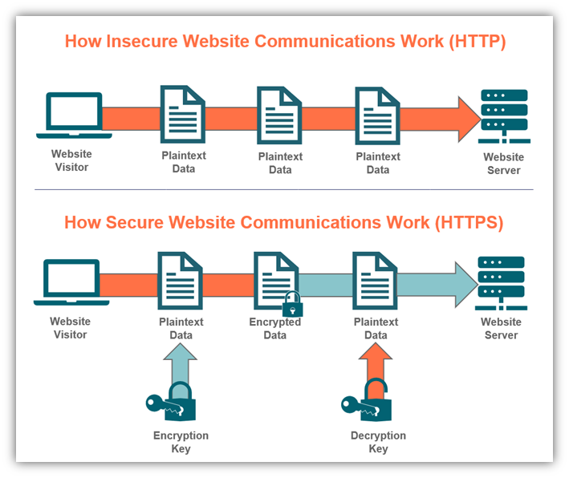

# Term 1 A1 Assignment: Christopher Lee 12189@CoderAcademy.edu.au

### **Assignment Brief: Demonstrate knowledge of fundamental programming concepts and the web. Provide a series of short answers to the specified questions.**

# **Question 1: Identify and explain common and important components and concepts of web development markup languages.**

Three popular markup languags that you are likely to encounter in your career in computer science are: HTML, XML and XHTML. These versions share similarites and differences; as the internet evolves and grows, so do markup languages. However, with an evolving web environment, continuity and compatability issues can arise. This issue was predicted and as such, versions of HTML represent standardized improvements to the foundational language for the World Wide Web. This standardization however, does not mean that these markup languages do not have their differences. For example, when comparing the functionality of HTML and XML, it would be important to note that although they do similar things, how they do it is rather different. XML focuses on transporting data without any management towards the presentation of the document -for lack of a better word. This means, XML is very easy to work with. HTML however, focuses on the presentation of the document and as a consequence, its coding can become rather complex. 
Due to the aftermentioned standardization practices, both XML and HTML can work together.

Markup languages sharing compatability is great and all, but why do we even need markup languages in the first place?

In order for a browser to be able to interpret and reproduce information in the way we want, we need to provide a uniform structure to the web pages we create. Structuring our web page to explain where to place certain content, how certain content should look and even conditions upon how we want content to behave allows use to produce reliable, intentional and reproducable outcomes. This is where markup languages come into play, markup languages have the power needed for us to control very important components of web pages. Important components of web pages are things such as tables, forms, lists, headings and style. Using markup languages such as HTML, we can format our document and provide that information to the browser so that it replicates it on the web!

# **Question 2: Define the features of the following technologies that are essential in terms of the development of the internet**:
 - _packets_
 - _IP addresses (IPv4 and IPv6)_
 - _routers and routing_
 - _domains and DNS_  
# **Explain how each technology has contributed to the development of the internet.** 

**Packets**: Sending information across the internet is a mysterious capability that seemingly functions magically.However, the process of delivering data from one computer to another is actually a very logical process. To understand why data is broken down into packets, we first need to understand _how_ computers communicate. Computers communicate to one another using **binary**. Computers use transistors to act like electronic swithces, being that they are either _on_ or _off_. The simplest way to convey the desired command to another computer is through binary, being that the number 0 will represent **on** and the number 1 will represent **off**.   
  Now imagine you want to send a reasonably large sized file across the internet. In order to do that, both computers -or however many computers are on the recieving network- will _talk_ to one another via binary and corresponding electrical signals. Sending the file in one complete "package" will not be the most efficent way for your data to travel. Because the data is sent via a physical connection of wires, the possibility of congestion increases exponentially the moment more than 2 computers are involved.  
This is where packets come in.  
  Data is broken into packets in order to decrease latency and increase overall efficiency of the journey from one computer to another. These packets are sent as incredibly small, deconstructed "packages" which can then be reconstructed on the recieving end.  
Packets are seperated into incredibly small pieces of data - **_64kb_**- each of these pieces of data carries information that i being sent from one computer to another. For example; some of these packets will contain information regarding the sender, such as their ip address, others will contain information that explains how many packets the reciever should expect to see. Other packets serve purposes such as informing the recieving computer when it has reached the end of the packet sequence.   
 Because of the way this data is structure during sending, we are able to communicate with large networks and send information across the globe seemingly instantly. In terms of the development of the internet, i strongly believe that packets have contributed massively. Without packets, trasnfer efficiency of data  would be congested and slow, it would be a nightmare in todays world and would seriously hinder the progression and development of tech.  
 

 

**IP Addressess**: In order for us to transfer data across the internet, we need to know _where_ to actually send said data. Comparable to your physical street address, an IP address is used as a means to identify hardware on networks. To simplify, if you wanted to send a letter to a friend, you would need to know what their address is. Their physical address identifies their house on a street with multiple other houses. The same principle applies to computers. Having IP addresses, allows both devices to connect and trasnfer data over the internet. IP addresses are unique  and consist of a string of numbers seperated by periods. For ipv4, the older IP framework, the string of numbers are seperated into 4 sections. Each section ranges between 0 and 255. This means that an ipv4 IP address would look something like this: **127.0.0.1**.
One of the shortcomings of ipv4 is the sheer amount of hardware that exsits in the world today. Computers, routers, websites etc all have unique IP addresses. Consequently, this means we will reach the maximum amount of unqiue identifiers under this framework. So how do we get around this shortcoming? 
  Introducing ipv6. In order for ipv6 to adapt to the increasing amount of techonological presence in the modern world, it implemetedan alphanumerical hexadecimal notation. Meaning, IP addresses now contain both letters **and** numbers. Ipv6 uses 128-bit addresses formatted into 8 groups of 4 hexadecimal numbers.  
An example of an ipv6 IP address is: **2002:0de6:0001:0042:0100:8c2e:0370:7234**   
One of the benefits of such a complex string of numbers and letters is that even in 2022, each device can have its own IP address, as opposed to needing to reuse addresses or mask them.  
  In todays tech world, both ipv4 and ipv6 are in use. As tech continues to develop and old technology is retired, the use of ipv4 will slowly begin to decline until it is replaced entirely by ipv6.  
In terms of the development of the internet, ipv6 was an incredibly intelligent piece of technology implemented as a means to fix an originally unforseen problem. Its mere existence is nothing short of completely neccessary in todays world and its implementation is, in my opinion, an incredibly impressive feat of intelligence, perserverance and quick-thinking-problem-solving completed by engineers.  
 

 

**Routers and Routing:**
Routers are used to connect devices such as computers or phones to the internet. Typically, a wireless router will connect directly with a modem. From there, information can be recieved or transmitted to the internet. Routers use built in attenas to communicate with devices on the home network. A wired router however, would connect directly from the modem to the device (computer).
Earlier, i wrote about packets. Thats how information is broken down for "shipment". I then spoke about IP addresses, thats how the "shipment" knows where to go and where it came from. All of that is great but without routers, it doesnt mean much. See, the purpose of a router is to provide the framework for the other two actions to take place. Meaning, without network connectivity, the rest is meaningless. Routing is the ability to send or forward packets from my network to someone elses network (or vice versa).The role of the router is to connect the 2 (or more) networks and then manage the traffic within. Using something called a routing table (list of all possible paths on the network) routers are able to recieve packets, crosscheck the routing table and then figure out the fastest path to send that data along.
Because of its capability to route traffic between devices and the internet, your home devices are able to connect to the internet.
In terms of the development of the internet, routers have played a vital role as they are responsible for security, connectivity, packet filtering etc. These tasks are incredibly fascinating and seem to occur seemlessly thanks to the technology involved.  
   

   

**Domains and DNS**: Earlier, i wrote about IP addresses and their contribution to the function of the internet. One of the topics covered was Ipv6 and its Alphanumeric Hexadecimal notations. What a mouthful that is. When browsing the web, if we attempted to navigate our way around using IP addresses such as the ones Ipv6 provides, i suspect 90% of the population would struggle to memorize the address of even a single website. That could generate a problem. For us to browse the web more intuitively, we use something called **Domain Names**. Domain names are easily recognisable and you already have multiple memorised. For example, you already know the domain "_gmail_" and you already know the domain "_google_". Naturally, it is much easier to remember words, especially short words, and so, the **Domain Name System** (DNS) can act like a phonebook in the sense that, the complicated numbers are not what you need to know- only the names!  

When you enter a domain name into a browser, DNS will translate that domain name into its IP address and youll find yourself arriving at your desired website.
To write out the entire translation process of DNS to IP would result in quite a lenghty paragraph of complex terminology, so instead, i will simplify what is going on when we enter a domain name and it somehow spits out the correct IP address.  
There are 4 DNS Servers involved with the process of loading a webpage. These servers are : **DNS Recursor, Root Nameserver, TLD Nameserver and Authoritative Nameserver.**  

DNS Recursor: The recursor server handles queries from the clients machine, its role is to begin locating where the correlated IP address is and to also make any additional queries necessary in order to move forward with information that is both sufficient and as accurate as possible. The website "Cloudflare" likens the role of the Recursor server to that of a librarian, in the sense that a librarian will be asked where a particular book is located within a library.  

Root Nameserver: This server is the where the intitial translating steps happen.These servers are capable of directly answering queries made about cache and stored records. Typically, the role of the root nameserver is to narrow down more specific locations that are needed to correctly translate the domain name into an IP.  It is worth noting, the name Root Nameserver is allocated due to where the server itself operates. This server operates in the "Root" of the DNS administration hierarchy.

TLD Nameserver: TLD is an acronym that stands for Top Level Domain, using the library reference again (provided by the "Cloudflare" website), the TLD nameserver can be imagined as a specific rack of books stored in a library. By understanding the acronym, we can begin to notice the steps involved with narrowing down information relevant to the client query. This particular nameserver helps narrow down what were searching for due to it hosting the end of domain names. To clarfiy, if a website is called "www.google.com", the TLD server hosts the ".com" section of the domain name.  

Authoritative Nameserver: This server is the final step in the resolving process,think of this server as a large ledger or a large phone book. If this server has access to the requested information/records, it will be able to provide the translation needed from Domain to IP. Assuming everything runs smoothly and records are accessible, this nameserver will then provide the requested IP for the relevant domain to the DNS recursor that orginally requested it.  

So, what a journey that is, and to think this process happens in mere seconds with todays technology. In order to further understand, compare definitions against the picture below.  
  
   To concude this section and to define the contribution DNS makes and has made to the interent, the simplest way to do this is via a question.  
How many Ipv6 addresses do you think you can remember? And if you couldnt remember any, how would you keep a record of sites you wanted to visit?
  

   

# **Question 3: Define the features of the following technologies that are essential in terms of the development of the internet:**
 - TCP
 - HTTP and HTTPS
 - Web browsers (requests, rendering and developer tools)

# **Explain how each technology has contributed to the development of client and server communication over the internet (50 - 150 words for each technology**
**TCP:** TCP is an acronym that stands for Transmission Control Protocol. TCP enables the exchange of messages between computing devices and applications over a network.  Its functionality is designed around sending packets across the internet and further ensuring that the delivery of the data is successful. This particular protocol is one of the most popular protocols and it defines the standard for end-to-end data delivery methods. TCP organizes data in a manner that can be transmitted between the client and the server, additionally, the integrity of said data is ensured; in short, this is due to a connection that is established between the client and the server. Said server remains active during the entirity of the transfer. This is a massive leap forward for the devlopment of the internet as it means we have a way to implement a guarentee that our data can be sent from one location to another in a manner secure/stable enough that we know it will arrive in full. 

 
  
**HTTP and HTTPS:**  
HTTP: Hyper-text-transfer-protocol is most commonly used for the transfer of data between web servers and web browsers. This transfer of data allows us to view webpages. HTTP is one of the earliest protocols related to the internet. One of the disadvantages of HTTP is that there is no encryption on data passed between servers and browsers. Regardless, a typical data exchange between server and browser would involve the client machine requesting data and the server responding tothe request.  

HTTPS: Hyper-text-transfer-protocol-secure is the encrypted version of the aftermentioned HTTP. The purpose of encryption in regards to this protocol is to allow for the exchange of sensitive information or data with a server. Previously, with HTTP there was no encryption, consequently, this meant distributing sensitive information such as bank details was incredibly dangerous.
HTTPS use SSL (Secure-socket-layer) keys to ensure confidentiality and security of its connections. HTTPS prefixes can be found easily on most sites that require senstive data exchange such as your local banks website.   

 

**Web Browsers: (requests/rendering/developer tools):**  
Requests: When you place a request via a browser, a number of operations take place. Previous questions explain in further detail exactly how those operations are undertaken so i will use this oppurtunity to shed light on the order they occur and how they co operate. So, you enter a website into your web browser. Firstly, the browser will go to DNS servers to find where exaclty the address youre looking for is located. Secondly, the browser will then send a HTTP request to the server. This step is made possible via the TCP technology previously covered. Thirdly, when/if the request is approved by the server, packets will begin exchanging between the server and the client.Forth and final, the recieved packets reassemble at the client end and your browser will display the webpage. This order or operations happens incredibly fast and is responsible for the way we enjoy the internet in modern times. The development of this technology has seen increased efficiency in recieving, actioning and responding to requests.

**Rendering:** Put simply, the rendering of a website via a web browser is the process in which code, such as HTML or CSS is transformed into an interactive environment for a user to explore.While the webpage is loading, the server is sending files containing some type of formatting language, typically HTML. The browser engine takes these files and converts them from data into characters (HTML characters/code). HTML code is a readable formatting language that your web browser can use as a set of instructions. These instructions dictate where and how content is formatted and how it behaves. Because computers communicate directly using binary -which is not legible to the majority of people- the importance of rendering increases immensely. Websites need to be presented in a way that is legible, user friendly and intuitive. Renderding software/technology plays a vital role in coverting unfamiliar data into familiar means of content.  

**Developer tools:** Developer tools are an incredibly useful addition to browsers. These tools allow the user to inspect a range of formatting information that was used in the construction of the web page. These tools allow minor editing capabilites, though it is worth noting, changes made in the developer tools apply in your-eyes-only type of application; meaning, developer tools will allow you to do something like change the colour of the font on the page but these changes are for display/learning reasons and do not actually implement any new formatting onto the webpage. Browsing through the webpage with developer tools open allows you to see what CSS styling was used, where it was applied and how it affects the targeted content. This employs major benefits for learning developers that see something they like and want to reciprocate. Developer tools will display HTML, CSS and Javascript as well as what assessts were requested by the webpage and how long they took to load! Developer tools are an incredibly useful addition to your browser and the accessibility and education they provide to learning or learned developers is incredibly valuable.  

 

# **Question 4: Identify 3 data structures used in the python programming language and explain the reason for using each.**

# **Question 5: Describe the features of interpreters and compilers and how they are different.**

# **Question 6: Indentify 2 commonly used programming languages and explain the benefits and drawbacks of each.**

# **Question 7: Identify TWO ethical issues from the areas below and discuss the extent to which an IT professional is ethically responsible in terms of the issue.**

List of topics containing ethical issues:
 - access to a user’s personal information (medical, family, financial, personal attributes such as sexuality, religion, or beliefs)
 - intellectual property, copyright, and acknowledgement.
 - criminal acts such as theft, fraud, trafficking and distribution of prohibited substances, terrorism
 - GPS tracking data and other types of metadata, MAC addresses, hardware fingerprints
 - freedom of thought, conscience, speech and the media
 - aggressive sales and marketing practices designed to mislead and deceive consumers
 - trading of shares on the stock exchange OR crypto-currencies

For each ethical issue identify a source of legal information relating to the ethical issue and discuss whether the law is helpful in assisting a developer to act in an ethical way. (Word count guide: 200 words max)

Conduct research into a case study of ONE of the ethical issues you have chosen discuss how an ethical IT professional should respond to the case study and how they might mitigate or prevent ethical breaches. (Word count guide: 400 - 600 words)

**Identify 2 topics containing ethical issues and discuss ethical responsibility for IT professionals:** 

**Ethical Issue 1: Access to users personal information ethical issue:** In the modern world, there is a plethora of personal and sensitive information stored on the internet. The intended use for such sensitive personal information may be something along the lines of; communicating with doctors, communicating with banks, communicating with friends and family, storing information on a regularly used shopping website for a faster experience etc. All of this information made available to people and companies is done so with the intention that the use case of that data is relevant to what it was provided for.
Ethical issues around personal data, in my opinion, arise around that data being sold from company to company for the development of more personalised ads. For example, i personally provided my data to Facebook with the intention of being able to use it to commmunicate with family. I did not however, provide that data on the basis that it could be used as tool that can be sold and shared between other companies so that they can tailor ads and algothrims to encourage maximum spending/screen time on my end. Legally however, i agreed to the terms and conditions of using Facebook. This means that Facebook will collect and store my data. From there, Facebook uses my data as leverage in generating sales; meaning that advertising companies can reach out to Facebook and have them target users/myself with their ads. I believe this is an ethical issue because my data is knowingly being used against its intended purpose, without consent, to generate revenue.

So where does ethical responsibility of IT professionals fit into this issue with facebook?

Ethical responsibility for an IT professional is a little different. IT professionals are simply means to an end or a goal that is already set in progress, for example, Facebook's buisness model would not change based on which IT professional they engaged to complete the works. 
And so, we must consider ethical responsibility from the perspective of the individual, not the corporation. Ethical responsibility for an individual would represent itself as something like competence or honesty or working safely for yourself and for others - so as to not cause harm to others or yourself. Ethical responsibility would also include rejection of bribray/external influence for the benefit of ones self. This is incredibly important if you were to imagine the implications that bribery could have in the IT world. Bribery would constitute for a massive safety concern. Imagine if a domestic violence victim was to move house, away from their abuser. Say the abuser was to then go to an IT professional and bribe them to provide sensitive information they may have access to. Examples like these seem extreme, but they really do a good job at emphasising just how sensitive personal information/data can be.

**Ethical issue 2: Intellectual property, copyright, and acknowledgement:**

Ease of access to information is afforded to everyone with an internet connection. This is an absoultely insane privilege to have. Because of this, we are able to undertake education in ways not previously even imaginable, share information and locate knowlege that otherwise wouldve taken an enourmous effort to find. Because of this ease of access, the redistribution of any information/creation is incredibly common. This is where intellectual property and copyrights enter the mix. People deserve credit for their discovers, they deserve ackowledgement for their efforts and they also deserve the monetery value that their works may reap. After all, why would anyone innovate anything if everyone was allowed to copy/steal it and use it for their own benefit without acknowledging the efforts involved to the creator?
This very idea is where a lot of potential ethical issues can arise. Plagerising work in the academic world is just about the largest sin a student could commit. And so, there is a  large degree of ethical responsibility on students. Learning materials can be studied, paraphrased, referenced, quoted etc. All of these examples will actually further a students understanding of the source material. For IT students and professionals, ethical responsibility follows the same basic ideas as mentioned, but the line becomes a bit muddied when put into practice. To elaborate, there is a finate amount of ways for someone to write code that will produce a specific outcome. Consequently, work completed by professionals and by students is bound to eventually bear many similarites or even become the same. So what are the ethical responsibilities for IT personnel? I feel that personnel in the IT community will still be able to perform majortity of their works while following regular ethical practices; ie referencing, quoting, paraphrasing. In situations where they may need to use code that they did not write, depending on the source of that information, they may not even have any extra responsibilities towards ethical use of the information. For example, Stack Overflow is a website commonly used by developers, on the forum, people often ask questions or advice to which other users respond with a functional piece of code etc. This information was provided with the intent and implied permisson that it could be used in another environment outside of the forum, for another purpose. That information has no intention of gaining intellectual property status/copyright. And so, that infomration is ethically sourced, ethically used and will not require a reference or fear of repurcussion.
To summarise, Intellectual property is important in ensuring the integrity, quality, accuracy and originality of information or inventions. Copyright laws are put in place to protect intellectual properties of an individual or company.
This ensures that people are correctly acknowledged for their work/efforts and their discoveries. It ensures they rightfully receive monetery compensation for their work (where applicable) and it proctects and encourages innovation.

**For each ethical issue identify a source of legal information relating to the ethical issue and discuss whether the law is helpful in assisting a developer to act in an ethical way: (Word count guide: 200 words max)**

**Ethical Issue 1 - _Continuation of Access to users personal information ethical issue_ - identify a source of legal information relating to the ethical issue and discuss whether the law is helpful in assisting a developer to act in an ethical way:**